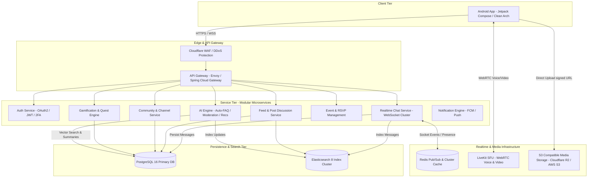

# 02. System & Data Architecture Specification

---

## 1. High-Level System Architecture Diagram



---

## 2. PostgreSQL Relational Database Schema (ERD)

Below is the complete production PostgreSQL schema DDL defining core entities, relationships, constraints, and indexes.

```sql
-- Enums
CREATE TYPE role_type AS ENUM ('SYSTEM_ADMIN', 'OWNER', 'CO_OWNER', 'ADMIN', 'MODERATOR', 'VERIFIED_EXPERT', 'VIP', 'MEMBER', 'MUTED', 'GUEST');
CREATE TYPE channel_type AS ENUM ('TEXT_CHAT', 'DISCUSSION_FEED', 'VOICE', 'ANNOUNCEMENT', 'EVENT', 'RESOURCE');
CREATE TYPE post_type AS ENUM ('TEXT', 'IMAGE', 'VIDEO', 'POLL', 'LINK', 'THREAD');
CREATE TYPE event_type AS ENUM ('ONLINE_MEETUP', 'WEBINAR', 'TOURNAMENT', 'WORKSHOP', 'HACKATHON', 'OFFLINE_MEETUP');

-- 1. USERS TABLE
CREATE TABLE users (
    id UUID PRIMARY KEY DEFAULT gen_random_uuid(),
    username VARCHAR(32) UNIQUE NOT NULL,
    email VARCHAR(255) UNIQUE NOT NULL,
    password_hash VARCHAR(255),
    display_name VARCHAR(64) NOT NULL,
    avatar_url TEXT,
    banner_url TEXT,
    bio TEXT,
    location VARCHAR(128),
    website_url TEXT,
    github_handle VARCHAR(64),
    linkedin_handle VARCHAR(64),
    reputation_score INT DEFAULT 0,
    level INT DEFAULT 1,
    current_xp BIGINT DEFAULT 0,
    is_verified BOOLEAN DEFAULT FALSE,
    is_suspended BOOLEAN DEFAULT FALSE,
    created_at TIMESTAMP WITH TIME ZONE DEFAULT CURRENT_TIMESTAMP,
    updated_at TIMESTAMP WITH TIME ZONE DEFAULT CURRENT_TIMESTAMP
);

CREATE INDEX idx_users_username ON users(username);
CREATE INDEX idx_users_reputation ON users(reputation_score DESC);

-- 2. CATEGORIES TABLE (Hierarchical)
CREATE TABLE categories (
    id UUID PRIMARY KEY DEFAULT gen_random_uuid(),
    parent_id UUID REFERENCES categories(id) ON DELETE SET NULL,
    name VARCHAR(64) NOT NULL,
    slug VARCHAR(64) UNIQUE NOT NULL,
    icon_url TEXT,
    display_order INT DEFAULT 0
);

-- 3. COMMUNITIES TABLE
CREATE TABLE communities (
    id UUID PRIMARY KEY DEFAULT gen_random_uuid(),
    category_id UUID NOT NULL REFERENCES categories(id),
    creator_id UUID NOT NULL REFERENCES users(id),
    name VARCHAR(64) NOT NULL,
    slug VARCHAR(64) UNIQUE NOT NULL,
    description TEXT,
    icon_url TEXT,
    banner_url TEXT,
    member_count INT DEFAULT 1,
    is_private BOOLEAN DEFAULT FALSE,
    created_at TIMESTAMP WITH TIME ZONE DEFAULT CURRENT_TIMESTAMP
);

CREATE INDEX idx_communities_category ON communities(category_id);
CREATE INDEX idx_communities_slug ON communities(slug);

-- 4. COMMUNITY ROLES & PERMISSIONS
CREATE TABLE community_roles (
    id UUID PRIMARY KEY DEFAULT gen_random_uuid(),
    community_id UUID NOT NULL REFERENCES communities(id) ON DELETE CASCADE,
    name VARCHAR(32) NOT NULL,
    color_hex VARCHAR(7) DEFAULT '#FFFFFF',
    icon_url TEXT,
    priority INT DEFAULT 0,
    permission_bitmask BIGINT NOT NULL DEFAULT 0, -- Bitmask for 64 detailed permissions
    is_default BOOLEAN DEFAULT FALSE,
    created_at TIMESTAMP WITH TIME ZONE DEFAULT CURRENT_TIMESTAMP
);

-- 5. COMMUNITY MEMBERS
CREATE TABLE community_members (
    id UUID PRIMARY KEY DEFAULT gen_random_uuid(),
    community_id UUID NOT NULL REFERENCES communities(id) ON DELETE CASCADE,
    user_id UUID NOT NULL REFERENCES users(id) ON DELETE CASCADE,
    role_id UUID REFERENCES community_roles(id) ON DELETE SET NULL,
    joined_at TIMESTAMP WITH TIME ZONE DEFAULT CURRENT_TIMESTAMP,
    xp_in_community BIGINT DEFAULT 0,
    UNIQUE(community_id, user_id)
);

CREATE INDEX idx_members_user ON community_members(user_id);
CREATE INDEX idx_members_community ON community_members(community_id);

-- 6. CHANNELS TABLE
CREATE TABLE channels (
    id UUID PRIMARY KEY DEFAULT gen_random_uuid(),
    community_id UUID NOT NULL REFERENCES communities(id) ON DELETE CASCADE,
    name VARCHAR(64) NOT NULL,
    type channel_type NOT NULL DEFAULT 'TEXT_CHAT',
    topic TEXT,
    is_private BOOLEAN DEFAULT FALSE,
    display_order INT DEFAULT 0,
    created_at TIMESTAMP WITH TIME ZONE DEFAULT CURRENT_TIMESTAMP
);

-- 7. CHAT MESSAGES TABLE
CREATE TABLE chat_messages (
    id UUID PRIMARY KEY DEFAULT gen_random_uuid(),
    channel_id UUID NOT NULL REFERENCES channels(id) ON DELETE CASCADE,
    sender_id UUID NOT NULL REFERENCES users(id),
    reply_to_message_id UUID REFERENCES chat_messages(id) ON DELETE SET NULL,
    content TEXT,
    attachments JSONB DEFAULT '[]'::jsonb, -- Photos, Videos, Code Snippets, Files
    is_pinned BOOLEAN DEFAULT FALSE,
    is_edited BOOLEAN DEFAULT FALSE,
    created_at TIMESTAMP WITH TIME ZONE DEFAULT CURRENT_TIMESTAMP,
    updated_at TIMESTAMP WITH TIME ZONE DEFAULT CURRENT_TIMESTAMP
);

CREATE INDEX idx_messages_channel_created ON chat_messages(channel_id, created_at DESC);

-- 8. FEED POSTS TABLE (Reddit-style)
CREATE TABLE posts (
    id UUID PRIMARY KEY DEFAULT gen_random_uuid(),
    community_id UUID NOT NULL REFERENCES communities(id) ON DELETE CASCADE,
    channel_id UUID REFERENCES channels(id) ON DELETE SET NULL,
    author_id UUID NOT NULL REFERENCES users(id),
    title VARCHAR(255) NOT NULL,
    content TEXT,
    type post_type DEFAULT 'TEXT',
    media_urls JSONB DEFAULT '[]'::jsonb,
    upvote_count INT DEFAULT 0,
    downvote_count INT DEFAULT 0,
    comment_count INT DEFAULT 0,
    is_pinned BOOLEAN DEFAULT FALSE,
    created_at TIMESTAMP WITH TIME ZONE DEFAULT CURRENT_TIMESTAMP
);

CREATE INDEX idx_posts_community_created ON posts(community_id, created_at DESC);

-- 9. NESTED COMMENTS TABLE
CREATE TABLE comments (
    id UUID PRIMARY KEY DEFAULT gen_random_uuid(),
    post_id UUID NOT NULL REFERENCES posts(id) ON DELETE CASCADE,
    parent_comment_id UUID REFERENCES comments(id) ON DELETE CASCADE,
    author_id UUID NOT NULL REFERENCES users(id),
    content TEXT NOT NULL,
    upvote_count INT DEFAULT 0,
    created_at TIMESTAMP WITH TIME ZONE DEFAULT CURRENT_TIMESTAMP
);

CREATE INDEX idx_comments_post ON comments(post_id);

-- 10. EVENTS TABLE
CREATE TABLE events (
    id UUID PRIMARY KEY DEFAULT gen_random_uuid(),
    community_id UUID NOT NULL REFERENCES communities(id) ON DELETE CASCADE,
    creator_id UUID NOT NULL REFERENCES users(id),
    title VARCHAR(128) NOT NULL,
    description TEXT,
    event_type event_type NOT NULL,
    start_time TIMESTAMP WITH TIME ZONE NOT NULL,
    end_time TIMESTAMP WITH TIME ZONE NOT NULL,
    location_url TEXT,
    max_attendees INT,
    rsvp_count INT DEFAULT 0,
    created_at TIMESTAMP WITH TIME ZONE DEFAULT CURRENT_TIMESTAMP
);

-- 11. BADGES & ACHIEVEMENTS
CREATE TABLE badges (
    id UUID PRIMARY KEY DEFAULT gen_random_uuid(),
    name VARCHAR(64) NOT NULL,
    description TEXT,
    icon_url TEXT NOT NULL,
    badge_category VARCHAR(32) NOT NULL, -- SYSTEM, COMMUNITY, SKILL
    created_at TIMESTAMP WITH TIME ZONE DEFAULT CURRENT_TIMESTAMP
);

CREATE TABLE user_badges (
    user_id UUID REFERENCES users(id) ON DELETE CASCADE,
    badge_id UUID REFERENCES badges(id) ON DELETE CASCADE,
    awarded_at TIMESTAMP WITH TIME ZONE DEFAULT CURRENT_TIMESTAMP,
    PRIMARY KEY (user_id, badge_id)
);
```

---

## 3. Redis In-Memory Data Structures

Redis is utilized for high-throughput, low-latency transient state management:

1. **User Realtime Online Presence**:
   - Key: `presence:user:{user_id}`
   - Type: Hash (`status`: "ONLINE" | "IDLE" | "DND" | "OFFLINE", `last_active`: Epoch ms, `current_channel`: `{channel_id}`)
   - TTL: 60 seconds (Heartbeat refreshed via WebSocket).

2. **Channel Active Typers**:
   - Key: `typing:channel:{channel_id}`
   - Type: Set (contains list of active `user_id`s typing, expired via TTL script).

3. **Active Voice Room Participants**:
   - Key: `voiceroom:{channel_id}:participants`
   - Type: Hash (`user_id` $\rightarrow$ JSON payload of mic status, screen share status, audio track ID).

4. **API Rate Limiter**:
   - Key: `ratelimit:{user_id}:{endpoint}`
   - Type: String counter with 1-minute TTL sliding window.

5. **Community XP Leaderboard**:
   - Key: `leaderboard:community:{community_id}`
   - Type: Sorted Set (ZSET) where Score = `xp_amount`, Member = `user_id`.

---

## 4. Elasticsearch Index Mappings

### Community Index Mapping (`hobbyhub_communities`)
```json
{
  "mappings": {
    "properties": {
      "id": { "type": "keyword" },
      "name": { "type": "text", "analyzer": "standard" },
      "slug": { "type": "keyword" },
      "description": { "type": "text" },
      "category_name": { "type": "keyword" },
      "tags": { "type": "keyword" },
      "member_count": { "type": "integer" },
      "created_at": { "type": "date" }
    }
  }
}
```

### Feed Post Index Mapping (`hobbyhub_posts`)
```json
{
  "mappings": {
    "properties": {
      "id": { "type": "keyword" },
      "community_id": { "type": "keyword" },
      "author_id": { "type": "keyword" },
      "title": { "type": "text", "analyzer": "english" },
      "content": { "type": "text", "analyzer": "english" },
      "post_type": { "type": "keyword" },
      "upvote_count": { "type": "integer" },
      "created_at": { "type": "date" }
    }
  }
}
```
