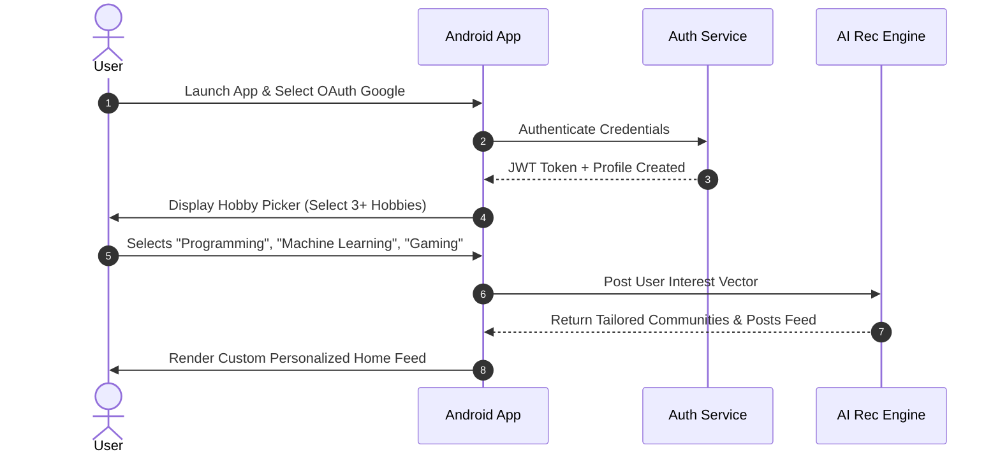
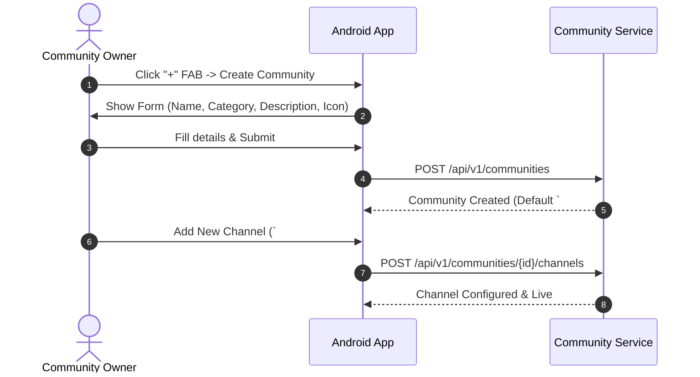
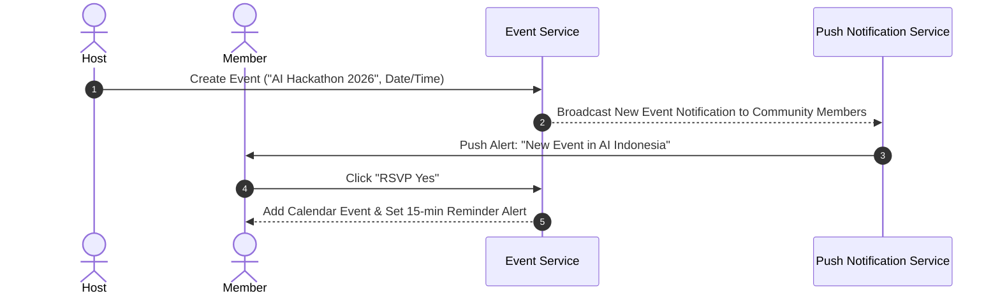

# 04. UI/UX Design System, Screen Specifications & User Flows

---

## 1. Material Design 3 Design System Tokens

HobbyHub features a modern, premium **Material Design 3 (Expressive)** UI with rich dark mode aesthetic, vibrant accent gradients, micro-interactions, subtle glassmorphism (`backdrop-filter: blur(16dp)`), and smooth 60fps animations.

### 1.1 Color Palette System (HSL & Hex)

```
Dark Theme (Default Primary)
├── Surface Background:    #0B0E14 (Deep Cosmic Obsidian)
├── Surface Elevation 1:  #141923 (Elevated Card Base)
├── Primary Accent:       #6C5CE7 (Vibrant Electric Violet)
├── Secondary Accent:     #00CEC9 (Cyber Turquoise)
├── Tertiary Accent:      #FF7675 (Warm Coral Pink)
├── On-Surface Text:      #F5F6FA (High Contrast White)
└── On-Surface Muted:     #A0A5B5 (Subtle Grey)

Light Theme (Optional Clean Mode)
├── Surface Background:    #F8F9FA (Crisp Pure Off-White)
├── Surface Elevation 1:  #FFFFFF (Pure White Card)
├── Primary Accent:       #5A49E0 (Deep Violet)
└── On-Surface Text:      #1A1D24 (Charcoal Black)
```

### 1.2 Typography System (Google Font: *Outfit* / *Inter*)
- **Display Large**: 32sp, Bold, Line Height 40sp (Hero Titles, Level Up Modals).
- **Headline Medium**: 22sp, SemiBold, Line Height 28sp (Community Names, Post Headers).
- **Title Medium**: 16sp, Medium, Line Height 24sp (Channel Names, Username Headers).
- **Body Medium**: 14sp, Regular, Line Height 20sp (Chat Content, Post Body text).
- **Label Small**: 11sp, Bold, Tracking 0.5sp (Role Badges, Timestamps, XP Badges).

---

## 2. Screen Specifications (15 Core Screens)

### Screen 1: Home / Explore & Hobby Discovery
- **Top Bar**: Search Bar with AI Auto-suggest, Notifications Bell, User Avatar with Level Indicator.
- **Hero Carousel**: Trending Communities (e.g., *AI Indonesia*, *Valorant Competitive*, *Flutter Devs*).
- **Category Chips**: Horizontal scrolling pills (*Programming*, *Gaming*, *Anime*, *Photography*, *Crypto*).
- **Feed Toggle**: [Explore Communities] | [Trending Posts] | [My Guilds].

### Screen 2: Community Hub & Channel Drawer
- **Left Navigation Drawer**: Accordion hierarchy (Category $\rightarrow$ Channel List).
- **Header**: Community Banner, Icon, Member Count, Guild XP Level, Join/Boost Button.
- **Channel Sections**:
  - 💬 **TEXT**: `#general`, `#questions`, `#projects`
  - 🔊 **VOICE**: `🔊 General Voice`, `🔊 Gaming Squad 1`
  - 📌 **FEED**: `📰 announcements`, `💡 showcase`
  - 🗓️ **EVENTS**: `📅 Upcoming Webinars`

### Screen 3: Public Global Chat
- **Layout**: Full-screen instant stream with pinned header topic.
- **Input Bar**: Text field, GIF picker, Attachment clip, Voice note button, Send FAB.
- **Moderation Tag**: Auto-flag icon if message triggered AI keyword safety check.

### Screen 4: Real-time Community Multi-Channel Chat
- **Layout**: Multi-pane layout on tablet / full-screen on mobile.
- **Features**: Message action sheet on long-press (Reply, React with Emoji, Pin, Report, Forward).
- **Code Syntax Highlight Box**: Formatted code blocks with language tag (Kotlin, Python, SQL) and 1-tap copy.

### Screen 5: Chat Thread & Media Viewer
- **Thread Panel**: Slides in from right when clicking "Reply in Thread".
- **Media Viewer**: Full-screen lightbox with zoom, EXIF data viewer (for photography channels), and download.

### Screen 6: Reddit-Style Public Feed
- **Post Card Layout**:
  - Top Bar: Author Avatar, Username, Community Pill, Role Badge (*Verified Expert*), Timestamp.
  - Body: Post Title, Rich Text Body / Image Carousel / Video Player / Interactive Poll.
  - Bottom Bar: Upvote/Downvote Counter, Comment Count, Share, Bookmark.

### Screen 7: Post Detail & Nested Comment Section
- **Comment Tree**: Indented multi-tier nested comments with expand/collapse threads.
- **Solution Marking**: Original Poster (OP) can click *"Accept as Answer"* to award author +50 XP.

### Screen 8: Create Post / Poll / Media Screen
- **Selector**: Choose Target Community & Channel.
- **Content Tabs**: [Text Article] | [Image/Video] | [Poll] | [Code Snippet] | [Link].
- **AI Assist**: "Enhance Title & Auto-tag" button powered by Gemini API.

### Screen 9: User Profile, Gamification, Badges & Level Specs
- **Header**: Banner image, Avatar with glowing Level Ring (*Level 42*), Bio, Social links (GitHub, LinkedIn).
- **XP Progress Bar**: `[████████░░] 8,450 / 10,000 XP (Level 42)`.
- **Badges Showcase Grid**: *Early Supporter*, *Top Mentor*, *Code Ninja*, *OG Member*.
- **Stats Card**: Total Upvotes, Answers Accepted, Events Hosted, Communities Joined.

### Screen 10: Role & Detailed Permission Manager (Admin Tool)
- **Role Creator**: Set Role Name, Color Picker, Custom Icon Uploader, Priority Slider.
- **Permission Matrix (Switches)**:
  - `[x]` Manage Channels
  - `[x]` Kick Members
  - `[x]` Ban Members
  - `[x]` Pin Messages
  - `[ ]` Manage Roles

### Screen 11: Community Event Hub & Live Host
- **Event Card**: Title, Date/Time Countdown (*Starts in 2h 15m*), Speaker Bios, RSVP Button.
- **Live Event View**: Stream view with live Q&A panel and attendee list.

### Screen 12: WebRTC Voice Channel Overlay
- **Floating Pill**: Persistent bottom sheet showing active voice participants.
- **Controls**: Mute Mic, Deafen Audio, Speaker Output, Push-to-Talk Button, Leave Room.

### Screen 13: AI Knowledge Assistant & Auto-FAQ Modal
- **UI**: Bottom drawer displaying instant AI-generated answers compiled from community threads.

### Screen 14: Moderation & Audit Log Dashboard
- **Queued Reports**: Reported messages/posts with AI toxicity confidence score (*98% Spam*).
- **Action Buttons**: [Approve] | [Delete & Warn] | [Temporary Ban 24h] | [Permanent Ban].

### Screen 15: Admin Growth & Analytics Dashboard
- **Charts**: DAU/MAU trends, Community Growth velocity, Top active creators, Revenue metrics.

---

## 3. End-to-End User Flows

### Flow 1: User Onboarding & Hobby Graph Selection



### Flow 2: Community & Channel Creation Flow



### Flow 3: Event Creation & RSVP Flow


